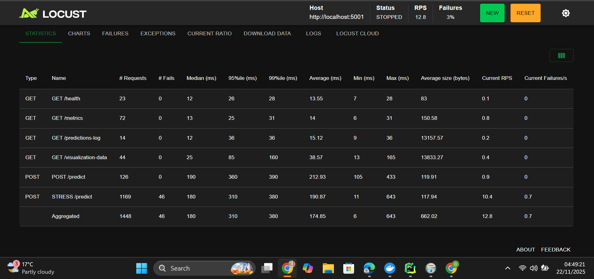

## Pneumonia Detection (HOG + Random Forest)

Fast Flask application that classifies chest X-rays as `NORMAL` or `PNEUMONIA` using Histogram of Oriented Gradients (HOG) features and a Random Forest classifier. The project includes a retraining flow, dataset helper, and simple UI pages for prediction and monitoring.

---

## Video link for demonstration
- https://youtu.be/tdbWlVpHlP8 


## 1. Prerequisites
- Python 3.10+ (recommended)
- pip / venv (or other virtual env manager)
- Git
- Kaggle account + API token for automated dataset download

Optionally install system packages required by OpenCV (varies per OS).

---

## 2. Clone and Environment Setup
```bash
git clone https://github.com/<your-username>/ML_Pipeline_Summative.git
cd ML_Pipeline_Summative

# (recommended) create a virtual environment
python -m venv .venv
.venv\Scripts\activate        # Windows
# source .venv/bin/activate   # macOS / Linux
```

---

## 3. Quick Online Preview
Want to explore the UI before running locally? The current Render deployment is available here:

[Live Demo (Render)](https://ml-pipeline-summative-ls9d.onrender.com)


The hosted version lets you click through the dashboard, prediction, retraining, and visualization tabs to understand the expected behavior before you set up the project locally. [^render]

[^render]: Deployment reference: https://ml-pipeline-summative-ls9d.onrender.com

---

## 4. Load Testing Snapshot
The API was stress-tested with Locust to verify `/predict`, `/metrics`, `/health`, and visualization endpoints under burst workloads. Screenshot below shows aggregate latency and request distribution during a “flood” simulation.



To reproduce, run `locust -f locustfile.py` and point the web UI at `http://127.0.0.1:5000`.

---

## 5. Download the Chest X-ray Dataset
Run the helper script from the project root:
```bash
python download_dataset.py
```

What this does:
- Downloads the final curated dataset directly from Dropbox  
  (`clean_chest_xray_dataset.zip`)
- Extracts it under `data/raw/`
- Mirrors the ready-to-train splits into `data/train`, `data/val`, and `data/test`

Prefer to download manually? Grab the same archive from Dropbox and unzip it inside `data/raw/`, then re-run the script to organize the folders:

[Dropbox – Clean Pneumonia Dataset](https://www.dropbox.com/scl/fo/iyugbgf5j5csvge5vn1oo/AEcvzlZpqYxtONMB_NU2z6E?rlkey=3ndh7ragaabbpkg2ktj6rks41&st=o78dis8l&dl=0)

---

## 6. Install Python Dependencies
After the dataset step completes, install the required libraries:
```bash
pip install --upgrade pip
pip install -r requirements.txt
```

---

## 7. Prepare / Verify Random Forest Model
The Flask API expects a trained Random Forest pickle at one of:
- `notebooks/random_forest_hog.pkl`
- `models/random_forest_hog.pkl`
- `random_forest_hog.pkl`
- `models/random_forest_base.pkl`

If you do **not** already have one, use either of the following:

**Option A – Notebook pipeline**
1. Open `notebooks/mobilenet_svm_pipeline.ipynb` in Jupyter.
2. Execute the cells sequentially; the notebook walks through data prep, HOG feature extraction, model training, and exports the `.pkl`.

**Option B – Retraining utilities**
```bash
python src/retraining.py --help
# or trigger retraining via the /retrain page once the app runs
```
Ensure the resulting `.pkl` is copied to one of the paths above.

---

## 8. Running the Flask App
From the repo root with the virtualenv active:
```bash
python app.py
```

On startup the app will:
- Initialize the SQLite database at `data/retraining.db`
- Attempt to load the Random Forest model (prints a warning if missing)
- Listen on `http://127.0.0.1:5000/`

Open the following routes in your browser:
- `/` dashboard
- `/predict-page` single image prediction UI
- `/retrain-page` upload + retraining workflow
- `/visualize` dataset metrics/plots

---

## 9. Optional: Batch / API Usage
- `POST /predict` with `multipart/form-data` (`file=<image>`) returns prediction JSON
- `POST /predict-batch` with `files=<image1> ...` handles multiple uploads
- `GET /metrics`, `/model-status`, `/health` expose runtime statistics

---

## 10. Troubleshooting
- **Model not loaded:** make sure the `.pkl` exists in one of the searched paths.
- **OpenCV import error:** install missing OS packages (on Ubuntu: `sudo apt install libgl1`).
- **Kaggle auth failure:** confirm `kaggle.json` permissions (chmod 600 on *nix).

Feel free to adapt these steps for Docker/Heroku deployment (compose and Procfile are already included). 
